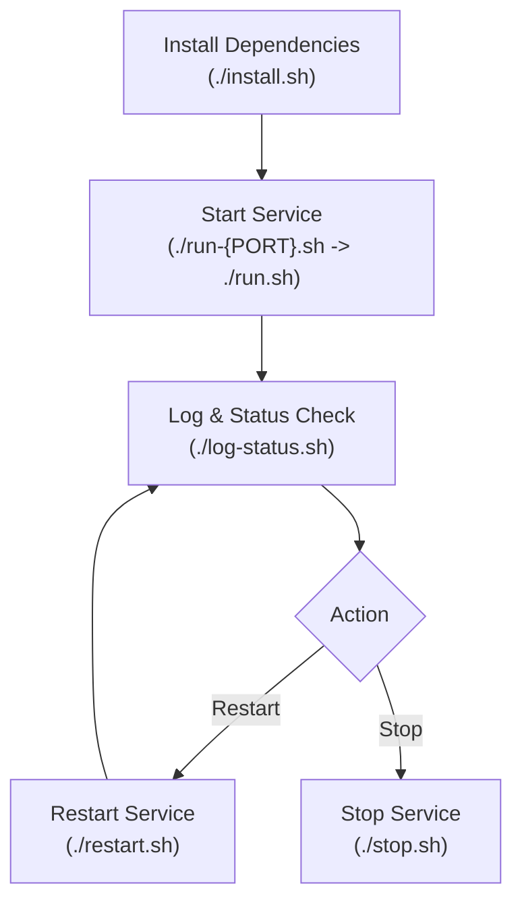

# Demo Wrapper Agent — Guidelines

## First Steps

Before planning, specs, UI, or features:

1. Create repo-root shell scripts (`*.sh`) if missing (see table below).
2. Add `.env` (e.g. `PORT=3000`) if needed.
3. Run `install.sh` → [`run-{PORT}.sh`](run.sh) → `log-status.sh` to verify the stack boots.

| Action | Command |
|--------|---------|
| Install | `./install.sh` |
| Run | [`run-{PORT}.sh`](run.sh) (e.g. `./run-3000.sh` → `./run.sh`) |
| Stop | `./stop.sh` |
| Log & Status | `./log-status.sh` |
| Restart | `./restart.sh` |

Scripts should be clean shell scripts; started processes run in the **background**. `restart.sh` calls stop then run.

### Execution Flow

## Submodules & Subfolders

> [!IMPORTANT]
> **Never edit, update, delete, or commit changes inside subfolders or Git submodules.** Create patches or modifications on the root repository (this folder) only. Update upstream or bump the tracked commit reference in this repo.

## Python

Python apps always use `uv` for dependencies and running (`uv init`, `uv add`, `uv sync`, `uv run`). Wrapper scripts install with `uv sync` (for `pyproject.toml` subfolders) and launch via `uv run` (project `.venv`, never system `pip`/`python3`).

## E2E Testing

Verify features with browser tools. Save screenshots to:

`screenshots/<module_number>_<module_name>/<function_number>_<function_name>/<step_number>_<before|after>_<action_name>.png`

## Issues

Record blocking issues in `/issues/` with numbered filenames.
