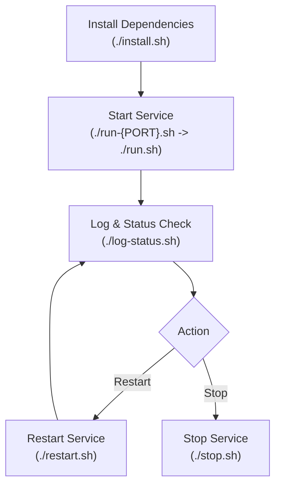

# demo-wrapper-only

Parent repository for running demo applications via shell scripts. Application code lives in Git submodules; this repo provides stack orchestration, configuration, and tooling.

## Prerequisites

- Bash / POSIX shell environment
- Git (with submodule support)

## Quick Start

1. Clone with submodules: `git submodule update --init --recursive`
2. Configure `.env` (e.g. `PORT=3000`) if needed.
3. Run **install** → [`run-{PORT}.sh`](run.sh) → **log-status** to verify the stack boots.

| Action | Command |
|--------|---------|
| Install | `./install.sh` |
| Run | [`run-{PORT}.sh`](run.sh) (e.g. `./run-3000.sh` → `./run.sh`) |
| Stop | `./stop.sh` |
| Log & Status | `./log-status.sh` |
| Restart | `./restart.sh` |

Started processes run in the background. `./restart.sh` calls stop then run.

### Execution Flow

## Submodules & Subfolders

**Do not edit files inside subfolder or submodule directories from this repo.** Create patches or modifications on the root repository only. Update content upstream, then bump the tracked commit reference here.

## Testing & Issues

- **E2E screenshots**: `screenshots/<module_number>_<module_name>/<function_number>_<function_name>/<step_number>_<before|after>_<action_name>.png`
- **Blocking issues**: record in `issues/` with numbered filenames.

## AI Agents

See [AGENTS.md](AGENTS.md).
